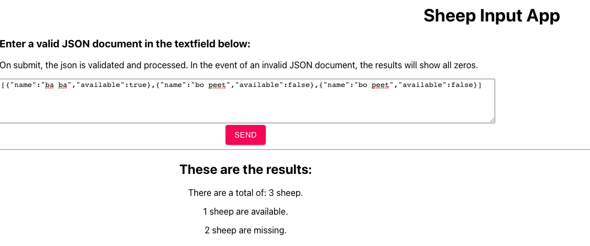

# CountingSheep
Website for counting sheep.

The site will allow the users to provide a validated JSON Document contains a list sheep, once the document is validated, the user will be allowed the submit the document to the count sheep function which will return the total number of sheep available and missing.  Both values should be presented to the users.

The website is here: 

https://main.d3jzw95ngp4p3x.amplifyapp.com/

## Input format

The input JSON document containing a list of sheep:
  sheep: [
    { "name": "ba ba", "available": true },
    { "name": "bo peet", "available": false }
  ]
  - if not available then the sheep is missing

## Output

6. Solution:

  a. Create the CountSheep function using Javascript. It takes as input an array of JSON sheep  objects and returns the results. Create test cases. Use Yup for validation.
  b. First validate the json. return errors if json is invalid.
  c. Tally up the results. 
  d. return JSON results.
  e. Display results to user.
  f. Since we're building a website that requires hosting, I'll use AWS amplify for hosting since it's an easy solution. Also, I'll be useing ReactJS for all javascript code.

Create an amplify project that includes hosting. 

